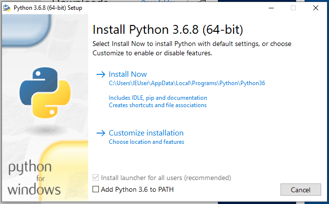

Instalación de Python
=====================

En esta guía vamos a ver distintas formas de realizar la instalación de la
la versión específica de **Python** que se utilizará en la cátedra para distintos
sistemas operativos.

El objetivo es que todos los alumnos que cursen la cátedra puedan instalar
en sus sistemas operativos la versión específica de **Python** que vamos a usar
dentro de la cátedra.

El mecanismo para esto es utilizar una herramienta de manejo de versiones para
**Python** (Python Versión Manager) en los sistemas operativos Linux y MacOS.

En el caso del sistema operativo Windows no vamos a usar esta herramienta ya
que no funcionan del todo bien, y tampoco algunas alternativas que probamos. En
este caso vamos a instalar la versión específica de **Python** que utilicemos.


## ¿Por qué usar una herramienta para manejar versiones?

La idea de usar este tipo de herramientas son:

- Instalar prácticamente cualquier versión de **Python** (o del lenguaje que sea)
- Tener instaladas múltiples versiones

Otro objetivo para esta cátedra es lograr que todos ustedes tengan exactamente
la misma versión de **Python**.

La herramienta que vamos a usar es [`pyenv`](git@github.com:pyenv/pyenv.git)

## Linux y MacOS

### Instalación con Git (Linux y MacOS) RECOMENDADA

Hacer el *checkout* de `pyenv` en el directorio donde quieras que se instale.
Un buen lugar puede ser `$HOME/.pyenv`.

```bash
git clone https://github.com/pyenv/pyenv.git ~/.pyenv
```

Define la variable de entorno `PYENV_ROOT` para tener disponible el *path* donde
fue clonado el repositorio y agrega `$PYENV_ROOT/bin` a la variable `$PATH` para
tener acceso al comando `pyenv` en la terminal.

```bash
echo 'export PYENV_ROOT="$HOME/.pyenv"' >> ~/.bash_profile
echo 'export PATH="$PYENV_ROOT/bin:$PATH"' >> ~/.bash_profile
```

!!! warning
    - Si usas **ZSH** modifica el comando con `~/.zshrc` en lugar de
    `~/.bash_profile`.
    - Para **Ubuntu** y **Fedora** usa `~/.bashrc` en en lugar de
    `~/.bash_profile`.

Finalmente para terminar de configurarlo y tener el autocompletado en la consola
ejecuta el siguiente comando:

```bash
echo -e 'if command -v pyenv 1>/dev/null 2>&1; then\n  eval "$(pyenv init -)"\nfi' >> ~/.bash_profile
```

!!! warning
    Al igual que en el paso anterior reemplaza con `~/.zshrc` o `~/.bashrc` en
    el comando según corresponda.

Luego reiniciar la terminal para que tome los cambios.

!!! info
    Guía completa en el [README de pyenv](https://github.com/pyenv/pyenv).

### Uso de `pyenv`

Para buscar que versión de **Python** queremos instalar podemos usar:

```bash
pyenv install 3.6.8
```

Ahora podemos seleccionar esta versión como global

```bash
pyenv global 3.6.8
```

o como versión local en el directorio que nos encontremos

```bash
pyenv local 3.6.8
```

### Instalación con brew (MacOS)

Se puede instalar `pyenv` usando el manejador de paquetes
[Homebrew](https://brew.sh/) para MacOS.

```bash
brew update
brew install pyenv
```

## Instalación en Windows

### Desde instalador

Descarga el instalador [aquí](https://www.python.org/ftp/python/3.6.8/python-3.6.8-amd64-webinstall.exe)

!!! warning
    Tener en cuenta de seleccionar el box de abajo para agregar el ejecutable de
    Python al PATH del sistema.

    

Otros instaladores: https://www.python.org/downloads/release/python-368/

Ahora tenemos la versión de Python que necesitamos en nuestro sistema y estamos
listo para utilizarlo.
