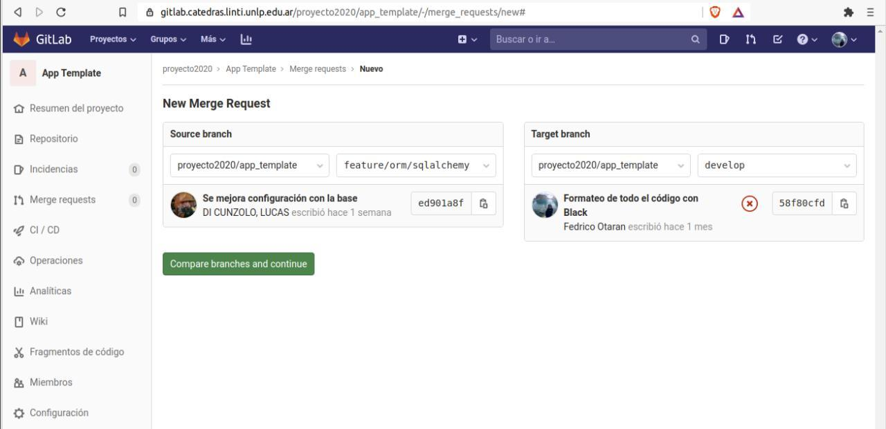

# Merge Request Gitlab

En esta guía vamos a mostrar como realizar un **Merge Request** dentro de
**Gitlab**.
El uso de **Merge Request** puede aportar mucho en el proceso de desarrollo por
varios motivos entre los que se destacan:

- Ayuda a que todo el equipo se mantenga al tanto de los cambios.
- Sirve para realizar la técnica de **Code Review**.
- Permite abrir una discusión o debate sobre la implementación de una nueva
  funcionalidad.

[Aquí](https://docs.gitlab.com/ee/user/project/merge_requests/) la documentación
oficial de **Gitlab** con mucho material sobre los **Merge Request**.

En esta guía veremos lo básico de la creación de un **MR** y el proceso de
aprobación.

## Crear un nuevo MR

Para crear un nuevo **MR** vamos al apartado **Merge Request** del menú
de nuestro proyecto.

Dentro de ese apartado *clickear* la opción **"Nueva solicitud de fusión"**.

En la siguiente ventana vamos a poder seleccionar cual es la rama origen y cual
la rama destino que queremos fusionar.

Luego de elegir las ramas que queremos fusionar podemos ver algo así:

Es necesario confirmar para pasar a la siguiente sección donde vamos a tener
un formulario para completar con información útil para el **Merge Request**.
Podemos ponerle una descripción, asignarlo a un compañero para que lo revise,
asociarlo a un *milestone* particular, agregarle etiquetas y configurar unas
opciones propias del **MR** como borrar la rama origen cuando se realice y usar la
estrategia *squash* para el *merge* de nuestros *commits*.

Además, se ve el resumen de los *commits* que se van a agregar a la rama destino
y una pestaña con los cambios que se van a realizar en los archivos.

Para confirmar la creación del **MR** se debe hacer *submit* con el botón
**"Submit merge request"**.

## Confirmar MR

Una vez confirmado pasamos a la vista del **Merge Request** creado donde se
pueden visualizar los cambios, comentar, aprobar los cambios y finalmente
realizar el *merge*.

Algunas veces la rama que queremos funcionar puede tener conflictos. Estos
conflictos **Gitlab** no los puede resolver, entonces no queda mas que avisar
del problema, pedir que se resuelvan para poder realizar el *merge*.

Para resolver estos conflictos tenemos que traernos a la rama origen los cambios
de la rama destino, es decir, hacemos un *merge* en sentido contrario. Luego queda
resolver los conflictos que ocurran para luego hacer un *push* en nuestra rama
origen.

Si todo sale bien, al volver a la ventana anterior ahora vamos a ver esto:

Ahora podemos realizar el *merge* sin ningún problema.
