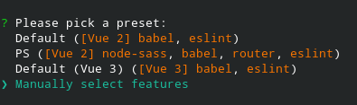
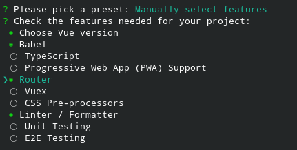
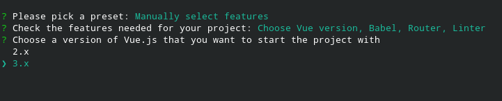
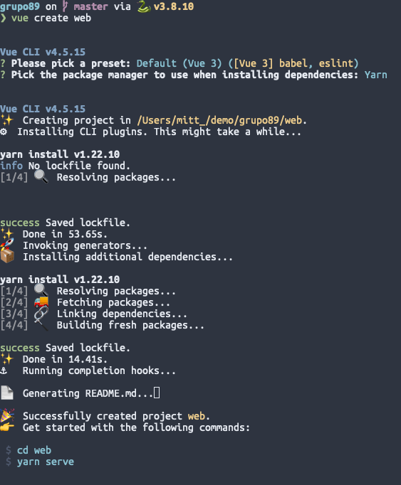
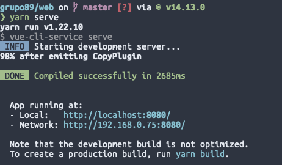
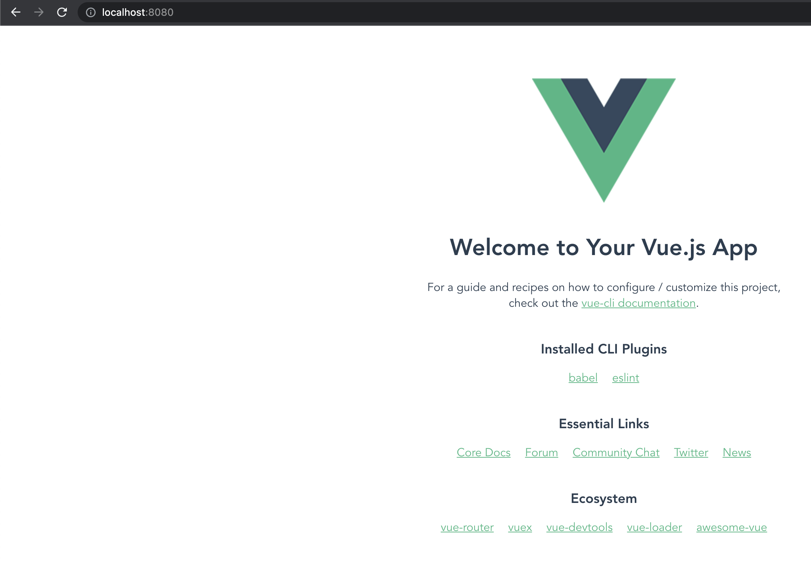
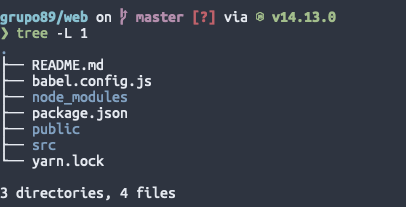
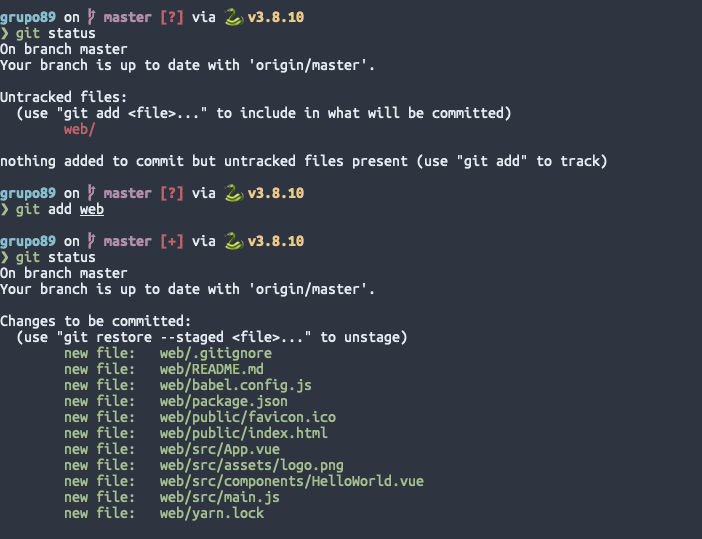
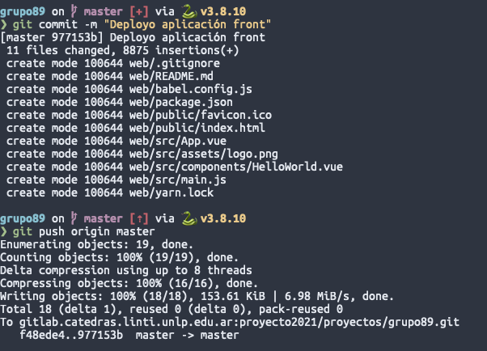
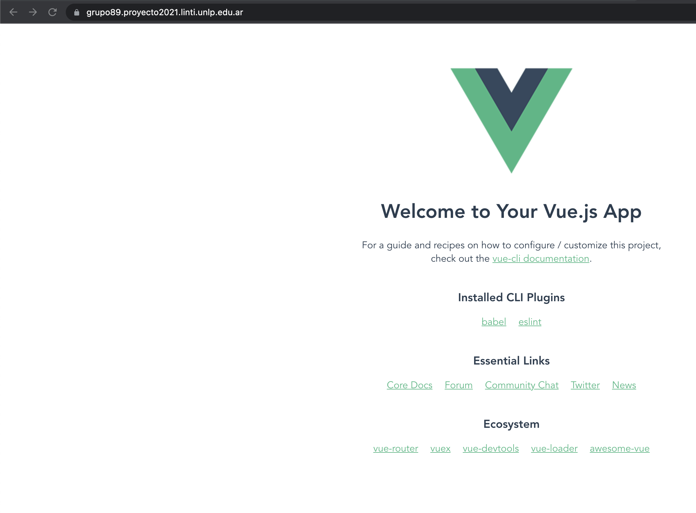

# Vue, primeros pasos

## Instalación de VueJS

La instalación de VueJS puede realizarse de muchas maneras. Todos los métodos disponibles
para instalar la herramienta se encuentra en el siguiente [enlace](https://v3.vuejs.org/guide/installation.html#release-note).

Para esta guía y como recomendación para el trabajo vamos a realizar la instalación de la
herramienta `vue-cli` que nos permitirá tener armar una configuración inicial para nuestro
proyecto VueJS. La guía de la misma la pueden encontrar [aquí](https://v3.vuejs.org/guide/installation.html#cli)

Siguiendo la guía para instalar la herramienta `vue-cli` hacemos:

```sh
# con yarn
yarn global add @vue/cli
```

O si usamos npm:

```sh
# con npm
npm install -g @vue/cli
```

Una vez terminada la instalación miramos si ya está disponible el comando:

```sh
❯ vue --version
@vue/cli 4.5.15
```

!!! Warning
Tal vez esto requiera de reiniciar su terminal

## Creando el template inicial

La documentación oficial para el uso de la herramienta `vue-cli` la encontramos [aquí](https://cli.vuejs.org/)

Para crear un nuevo proyecto debemos utilizar el comando `vue create <nombre>` que
nos permitirá crear un nuevo proyecto de forma interactiva:

!!! Info
Instalar la versión 3 de VueJS y usar el manejador de paquetes que ya tengan instalado en su máquina (yarn o npm)

Luego van a aparecer 3 opciones, una default para Vue2 otra default para Vue 3 y seleccion manual de las funcionalidades:

<figure markdown>
  
</figure>

Vamos a elegir la manual con las siguientes opciones:

<figure markdown>
  
</figure>

[Babel](https://babeljs.io/docs/en/) es una cadena de herramientas que se utiliza principalmente para convertir el código ECMAScript 2015+ en una versión de JavaScript compatible con versiones anteriores en navegadores o entornos actuales y antiguos.
[Router](https://router.vuejs.org/) VueRouter es el enrutador oficial de VueJS, permite generar rutas dinamicas para diferentes componentes.
[Linter/Formatter](https://eslint.org/) ESLint analiza estáticamente en base a diferentes reglas el código para encontrar rápidamente problemas y a su vez se puede configurar para que cuando se guarde un archivo arregle problemas de sintaxis como por ejemplo Black en python.

Por ultimo tenemos que elegir la version de VueJS en este caso vamos por la version 3.x

<figure markdown>
  
</figure>


!!! Warning
Recordar que tenemos que crear nuestro proyecto dentro de la carpeta `web` para que nuestra aplicación se pueda buildear
y ejecutar correctamente en el servidor.

Terminado el comando deberíamos ver algo como esto:

<figure markdown>
  
</figure>

Con el proyecto creado vamos a intentar levantar el server localmente ejecutando el siguiente comando:

<figure markdown>
  
</figure>

Levantado el servidor abrimos la aplicación en el puerto `8080` del navegador.

<figure markdown>
  
</figure>

El directorio de la aplicación nos quedó con los siguientes archivos y directorios:

<figure markdown>
  
</figure>

El proyecto ya tiene su propio git ignore donde evita versionar archivos como el `node_modules`.
Tener en cuenta de agregar los directorios que queramos ignorar más adelante.

## Subir los cambios al servidor

Para subir los cambios tenemos que agregar los archivos nuevos.

<figure markdown>
  
</figure>

Luego hacer un commit y un push a master.

<figure markdown>
  
</figure>

El servidor va a tardar unos minutos en hacer el build. Más que nada si es la primera vez.
Luego de un rato deberíamos ver los cambios en el servidor:

<figure markdown>
  
</figure>
