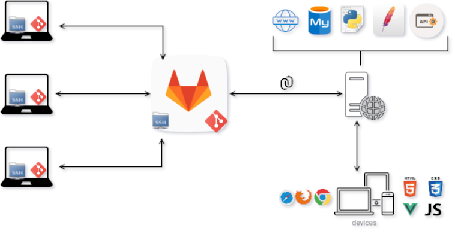

# Infraestructura del servidor la cátedra

Información de la infraestructura del servidor de la asignatura Proyecto de Software 2021.

## Versiones a utilizar
* Lenguaje: <strong>Python 3</strong>.
* Servidor Web: <strong>Apache 2.4</strong>.
* Servidor de Base de Datos: <strong>MariaDB</strong>.

## Código interpretado

* Backend Flask: [https://admin-grupoXX.proyecto2021.linti.unlp.edu.ar/](https://admin-grupoXX.proyecto2021.linti.unlp.edu.ar/)
* Frontend Vue: [https://grupoXX.proyecto2021.linti.unlp.edu.ar/](https://grupoXX.proyecto2021.linti.unlp.edu.ar/)

## Logs de Apache:
* Errores: [https://grupoXX.proyecto2021.linti.unlp.edu.ar/logs/apache_error_log](https://grupoXX.proyecto2021.linti.unlp.edu.ar/logs/apache_error_log)
* Accesos: [https://grupoXX.proyecto2021.linti.unlp.edu.ar/logs/apache_access_log](https://grupoXX.proyecto2021.linti.unlp.edu.ar/logs/apache_access_log)

## Detalles de la infraestructura

* En sus máquinas de desarrollo:
    - Par de claves SSH.
    - Repositorio Git Clonado.
    - Venv con dependencias instaladas.
    - Uso de ambiente de development (<strong>FLASK_ENV=development</strong>).

* En Gitlab:
    - Repositorio Central de Git.
    - Hook que se dispara ante cada <strong>push</strong> al Servidor Web Apache.

* En el Servidor Web Apache:
    - Servidor de MariaDB local (la BD <strong>s&oacute;lo</strong> se accede mediante <strong>localhost</strong>).
    - Uso de ambiente de producci&oacute;n (<strong>FLASK_ENV=production</strong>).
    - <strong>Virtualenv:</strong> Cada grupo tiene su ambiente virtual propio. Se instala lo que posea el <strong>requirements.txt</strong> de la raiz de su repositorio.
    - <strong>Aplicaci&oacute;n:</strong> cada virtualhost mediante <strong>mod_wsgi</strong> , activando en <strong>venv</strong> correspondiente ejecuta la aplicación que se encuentre en la ra&iacute;z de su repositorio.

* Sincronizaci&oacute;n ante un push:
    - Se actualiza el c&oacute;digo al &uacute;ltimo commit de la rama <strong>master</strong>.
    - Se instala en el virtualenv lo que se encuentre en <strong>requirements.txt</strong>.
    - Se hace un reload de la aplicaci&oacute;n.